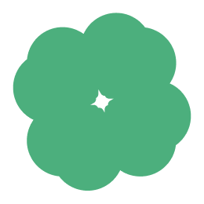

# ShallWe

> '쉬었음 청년'을 위한 AI 감정기록 챌린지 서비스
> 연세대 UXIM 3팀(레디액션) — React 프로토타입

[]() []() []() []()

<p>
  
  &nbsp;&nbsp;
  
</p>

---

## 서비스 소개

- **타깃**: 무기력감을 느끼는 청년 (PHQ-9 변형 자가진단 기반)
- **핵심 가치**: 비교 압박을 최소화한 마이크로 챌린지 + 감정 캘린더
- **MVP 범위**: 22 화면 클릭 가능 React 프로토타입 (백엔드 없음, mock 데이터)

> **현재 단계**: 디자인 시스템 + 와이어프레임 + 스프린트 플랜 완료. React 구현은 S1 시작 예정.

## 문서

| 문서 | 내용 |
|---|---|
| [`design.md`](./design.md) | 디자인 시스템 (컬러 / 타이포 / 컴포넌트 / 모션 토큰) — Figma 3TEAM 기준 |
| [`wireframe.md`](./wireframe.md) | 22 화면 ASCII 와이어프레임 + 화면별 개발 요청 기능 |
| [`plan.md`](./plan.md) | React 구현 플랜 (스택 / 폴더 구조 / 토큰 매핑 / 상태 관리 / 검증) |
| [`sprints.md`](./sprints.md) | 4 스프린트 인덱스 (S1~S4) |
| [`sprints/s1-foundation.md`](./sprints/s1-foundation.md) | Foundation: Vite 셋업 + 12 UI primitive |
| [`sprints/s2-onboarding.md`](./sprints/s2-onboarding.md) | Onboarding: PHQ-9 14 step Quiz + 결과 분기 |
| [`sprints/s3-main-app.md`](./sprints/s3-main-app.md) | Main: 4탭 + 챌린지 만들기/인증 풀 cycle |
| [`sprints/s4-polish.md`](./sprints/s4-polish.md) | Polish: 빈 상태 + 토스트 + 반응형 + 배포 |

## 기술 스택 (계획)

React 18 + TypeScript + Vite + Tailwind CSS + React Router v6 + React Hook Form + Zod + date-fns + Framer Motion + embla-carousel + lucide-react + Vitest + @testing-library/react

자세한 의존성 + 선택 이유는 [`plan.md` §1](./plan.md) 참고.

## 22 화면 구성

| 분류 | 화면 |
|---|---|
| **온보딩 (8)** | Splash · 서비스 소개 · 검사 안내 · 회원가입 · PHQ-9 자가진단 · 챌린지 선호 조사 · 결과 분석 · 결과 |
| **홈 (2)** | 오늘의 챌린지 + 모두의 챌린지 · 스크롤 상태 |
| **인증 (2)** | 인증 탭 · 챌린지 인증 (사진+글+공개) |
| **챌린지 만들기 (6)** | 추천 캐러셀 · 5단계 wizard (제목→기간→미션→기대효과→완료) |
| **다이어리 (2)** | 캘린더 (3상태 셀) · 게시물 상세 |
| **마이 (2)** | 마이페이지 · 설정 |

## 디자인 시스템 핵심

| 토큰 | 값 |
|---|---|
| Primary | `#24D455` (shallwe green) |
| Ink | `#232323` (텍스트 기본) |
| BG | `#F8F9F7` / `#EDF9E1` (gray / green tint) |
| 폰트 | Roboto + 한글 fallback (Pretendard 권장) |
| 사이즈 | Title 24 / Title 20 / Sub Title 16 / Body 14 / Body 12 — 12pt 미만 미사용 |
| 기준 디바이스 | iPhone 16 / 17 Pro Max (440 × 956pt) |

## 의도적으로 미구현 (프로토타입 단계)

- 실제 인증 (Google OAuth) — 데모 자동 가입
- 백엔드 / DB — 모든 데이터는 sessionStorage
- 사진 업로드 서버 — 로컬 blob URL
- AI 분석 — `setTimeout` 1.5초로 mock
- 푸시 알림 / 이메일 / 다크 모드

## 실행 방법 (S1 완료 후)

```bash
git clone https://github.com/inoaole/shall-we.git
cd shall-we
npm install
npm run dev
# http://localhost:5173
```

## 진행 현황

- [x] **S0 — Planning** : design.md / wireframe.md / plan.md / sprints/ 작성
- [x] **S1 — Foundation** (v0.0.1) : Vite 셋업 + 12 UI primitive + 라우팅 골격
- [x] **S2 — Onboarding Flow** (v0.0.1) : Splash → Quiz 14 step → Result 풀 클릭
- [x] **S3 — Main App** (v0.0.2) : 4탭 + 챌린지 만들기/인증 풀 cycle
- [x] **S4 — Polish & Demo Ready** (v0.0.3) : sonner 토스트 / fade-in 화면 전환 / 반응형
- [x] **Design Cleanup** (v0.0.5) : BackHeader · EmptyState 추출 / 토큰 정확성 / a11y
- [x] **Vercel 배포 준비** (v0.1.0) : `vercel.json` SPA fallback + 정적 자원 캐싱
- [ ] **(옵션) UT 일정 + 백엔드 연동**

## 팀

연세대 UXIM 3팀 — 레디액션

## 라이선스

학교 프로젝트 — 외부 사용 금지
